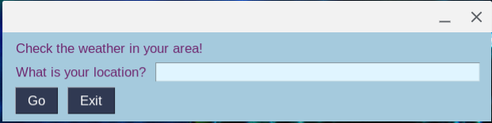
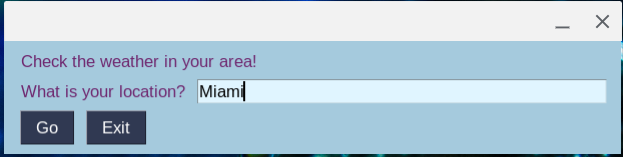
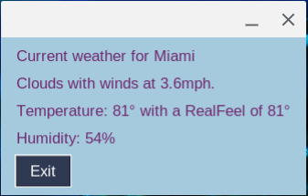

# hazy
A simple weather GUI program made in Python.

Thank you for the Silver Award on my Reddit post to [r/Python](https://reddit.com/r/python)!


# Prerequisites
- Any version of Python 3.x, up to Python 3.8.6
- An OpenWeatherMap API key. You can get one for free [here](https://home.openweathermap.org/users/sign_up).

# Installation

**Attention!** No matter what method you use, make sure you have a creds.json file in the same folder as the app, otherwise it will not run.

Sample config.json file:

```json
{
  "owm_key":"<your key here>"
}
```

## Preferred Method - Pre-built binaries
You can download the prebuilt binaries from the [Releases page](https://github.com/onyxcode/hazy/releases).

## Alternative Method - Run from Source
If you like rooting through source code like me, you can download the script in it's raw form. Whether this is to look for security flaws, add enhancements or just copy the code, I made the source available for download because after all, this is GitHub. *Psst, you can copy my code by the way, just be sure to credit me :D*

Clone the repo to your computer by typing:
```sh
git clone https://github.com/onyxcode/hazy.git
# Or, if you have github-cli installed:
gh repo clone onyxcode/hazy
```
Then, cd into the directory and run `python3 app.py`.


# Screenshots

## Inital view


## Typing a location


## Displaying the weather


## It took me forever to figure out, but I did manage to implement error handling!

